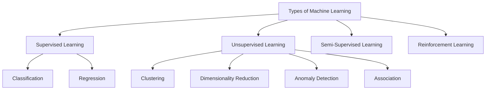
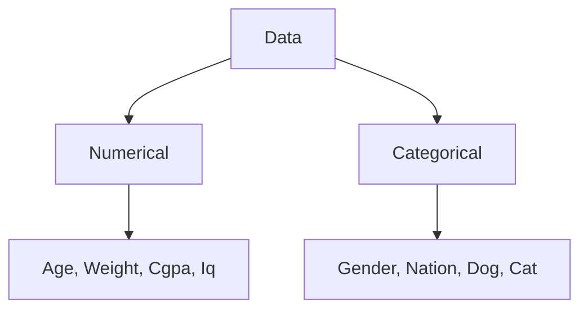

# # What is Machine Learning ??

Machin leraning is a field of computer science that uses statistical techniques to give computer systems the ability to "learn" with data, without being explicitly programmed.  

---

# # AI Vs ML Vs DL

## Key Differences

| Category | Description |
|--------|-------------|
| **AI (Artificial Intelligence)** | Smart application that can perform its own task without any human intervention |
| **ML (Machine Learning)** | Provides statistical tools to analyze, visualize, build predictive models, and perform forecasting |
| **DL (Deep Learning)** | Mimics the human brain using multi-layered neural networks |
| **Data Scientist** | – |

### Examples

- **AI**:  Self-driving cars, Robots, Alexa  
- **ML**:  Object Detection, Image Recognition, Chatbots  
- **DL**:   –  
- **Data Scientist**:  –  

### Real-World Applications

- **Amazon.in** → Product Recommendation System  
- **Netflix** → Product Recommendation System  

---

# # Types of Machine Learning

Types of Machine Learning on the Basis of amount of Supervision required to train a machine learning algorithm.

--- 

## 1. Supervised Machine Learning

A machine learning technique in which a model is trained using labeled data, where each input is associated with a known output, so that the model can learn to predict correct outputs for new, unseen inputs.

## Types of Data

## Types of Supervised Machine Learning

### (i) Classification 

- Classification is a type of supervised learning in which the output is a category or class (Categorical Data).
- The model predicts a class from predefined categories.

#### Example : 
> - Email → Spam / Not Spam
> - Student result → Pass / Fail

### (ii) Regression 

- Regression is a type of supervised learning in which the output is a continuous numerical (Numerical Data).
- The model predicts a numeric value.

#### Example : 
> - Predicting house price
> - Predicting marks based on study hours

---

## 2. UnSupervised Machine Learning

A type of machine learning in which the model is trained on unlabeled data, meaning there is no predefined output. The model automatically finds patterns, groups, or relationships in the data.

## Types of UnSupervised Machine Learning

### (i) Clustering 

- A technique that groups unlabeled data into clusters based on similarity.
- Its goal is to discover patterns or relationships within the data without any prior knowledge of categories or labels.
- Groups data points that share similar features or characteristics.

#### Example :
> An online store collects customer data such as age, income, and shopping behavior without any labels.  
> A clustering algorithm groups customers into clusters like:
> - Budget customers
> - Regular customers
> - Premium customers
> 
> This helps the company understand customer types without predefined categories.

### (ii) Dimensionality Reduction

- A technique used to reduce the number of input features (dimensions) in a dataset while preserving the important information.
- This technique helps simplify complex data making it easier to analyze and visualize.
- It also improves the efficiency and performance of machine learning algorithms by reducing noise and computational cost.
- Why It Is Used
  - Reduces **data complexity**
  - Improves **model speed**
  - Removes **redundant features**
  - Helps in **data visualization**

#### Example :

> Suppose a dataset contains 100 features about students (marks, attendance, behavior, activities, etc.).  
> Many of these features may be related or unnecessary.
> 
> Using dimensionality reduction:  
> - 100 features → reduced to 10 important features  
> - Data becomes simpler, faster to process, and easier to analyze  

### (iii) Anomaly detection

- A technique used to identify rare, unusual, or abnormal data points that significantly differ from normal data patterns.

#### Example :

> Credit card fraud detection:  
> - Normal transactions: ₹100, ₹250, ₹500  
> - Anomalous transaction: ₹1,00,000  
> The ₹1,00,000 transaction is very different from usual spending behavior, so it is detected as an anomaly.  

### (iv) Association Rule Learning

- Atechnique used to discover interesting relationships between variables in large datasets.
- It identifies patterns in the form of “if-then” rules, showing how the presence of some items in the data implies the presence of others.
- Commonly used in market basket analysis to understand product purchase relationships.

#### Example :

> In a supermarket:
> - Customers who buy Bread often also buy Butter.
> - Customers who buy Milk and Bread often buy Butter.
> 
> Rule Example:
> - If a customer buys Bread, then they are likely to buy Butter.

---

## 3. Semi-Supervised Learning

- A hybrid machine learning approach which uses both supervised and unsupervised learning.
- It uses a small amount of labelled data combined with a large amount of unlabelled data to train models.
- The goal is to learn a function that accurately predicts outputs based on inputs, similar to supervised learning, but with much less labelled data.

#### Example :
> Suppose we want to classify emails as Spam or Not Spam.
> - 100 emails are labeled (spam / not spam)
> - 10,000 emails are unlabeled
> The model first learns from the labeled emails and then uses patterns from the unlabeled emails to improve its classification.

---

## 4. Reinforcement Learning

- A type of machine learning in which an agent learns by interacting with an environment and improves its behavior by receiving rewards or penalties for its actions.
- It allows machines to learn by interacting with an environment and receiving feedback based on their actions.
- This feedback comes in the form of rewards or penalties.
- Key Elements
  - **`Agent`** – learner/decision maker
  - **`Environment`** – where the agent acts
  - **`Action`** – what the agent does
  - **`Reward`** – feedback from the environment

#### Example :

> Training a dog:
> - If the dog performs a trick correctly → reward
> - If it performs incorrectly → no reward / penalty

> Over time, the dog learns the best actions to get maximum rewards.

